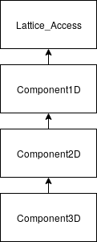
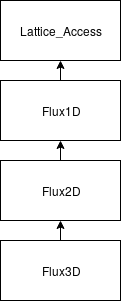

# Mesodyn

author: Daniël P. Emmery, 2018

## Table of contents
1. [Introduction](#introduction)
2. [Dependencies](#dependencies)
3. [Variables read from file](#input)
4. [Class definitions](#definitions)
  1. [Mesodyn](#mesodyn)
  2. [Lattice_Access](#lattice)
  3. [Gaussian](#gaussian)
  4. [Component](#component)
  5. [Flux](#flux)
5. [References](#references)

## Introduction 

The mesodyn classes are an implementation of dynamic mean-field theory, developed by Fraaije in the 1990s. It allows the user to generate the time evolution of multi-component system given the parameters used by the classic Namics SCF tools. Mesodyn uses inheritance to handle different dimensions of the system.

## Dependencies 
### System
Provides a list - called a mask - (variable `KSAM`) of where immovable objects are located (such as pinned or frozen molecules). This list is used to initialize the density profile and to disable fluxes to and from lattice sites with such objects. Moreover, the number of components in the system is read from `SysMolMonList`.

### Lattice
Contains all information on the geometry of the system and passes the boundary conditions to mesodyn contained in its `BC` vector. Mesodyn implements an interface to the lattice class called Lattice_access. The interface provides easy and consistent access to the lattice using 3 coordinates instead of an indexed vector. It is assumed (and asserted by Lattice_Access) that for 1D system, there is only an X dimension, for 2D an X and a Y dimension, and for 3D an X, Y, and Z dimension.

## Variables read from file 

The following inputs can be read from file using `Mesodyn : langevin : variable : value`

| C++ Variable         | Variable in input | Description    |
| -------------------- | ----------------- | -------------- |
| Real D               | diffusionconstant | Diffusion constant for the langevin flux |
| Real mean            | mean              | Mean of gaussian noise (should be 0)     |
| Real stdev           | stdev             | Standard deviation of gaussian noise (should be 1*D) |
| Real seed            | seed              | Seed of gaussian noise, for reproducable simulations including noise |
| int timesteps        | timesteps         | Length scale of the time evolution |
| int timebetweensaves | timebetweensaves  | How many timesteps before mesodyn writes the current variables to file |

## Class definitions 

### Mesodyn 

##### Introduction
Mesodyn is the book-keeper class for the implementation. It handles input and initialization, output, and the overall structure of the mesodyn algorithm. Variables that are not read from file are initialized in the initialization list. `CheckInput` is called from `main()` to read the input file, followed by `mesodyn()` that starts the actual algorithm:

1. Initialize density profile and construct helper classes `Flux` and `Component`
2. Open and format output file
3. Start loop:
  1. Prepare an indexed rho vector for Newton
  2. Call Newton to find potentials that correspond to the density profile
  3. Update the boundaries given the boundary conditions
  4. Compute fluxes
  5. Update densities
  6. Loop for given number of timesteps and write data to file for every given number of timesteps
  7. Return true when everything goes according to plan.

##### Functions
`CheckInput(int start)`  
First of two functions called from `main()`. Reads input from the .in file. Contrary to most variables that live in the mesodyn class, variables read from file are not marked `const`. If a variable is not specified in the .in file, the variable is given a default value. A developer adding a new input-readable variable in this function should also add them to `prepareOutputFile()`.
Argument `start` is passed from main via this function to the `Input` class and is not used by mesodyn.

`bool mesodyn()`  
Called from `main()` after `CheckInput()`. Provides the overall flow of the mesodyn algorithm and thus only calls other functions. It calls the functions that implement the capabilities described in the introduction.

`int initial_conditions()`  
Sets up the two helper classes, `Flux` and `Component` and passes the data needed for initialization. First, the mask (see system dependency) is read from system. The density profile is initialized using `init_rho(rho, mask)` (see below). It then constructs two vectors of size component number that contain pointers to the respective class instances of `Flux` and `Component`. Depending on the number of dimensions, these are instances of either the 1D, 2D or 3D version of the classes. This removes the need for lots of `if (dimension)` statements throughout the code. The boundary conditions are read from input or assigned a default value by `Lattice`. Called by `mesodyn()`.

`int init_rho(vector<vector<Real>>& rho, vector<int>& mask)`  
Computes the volume of the system (number of lattice sites minus solid objects) using the argument `mask` and distributes the theta (sum of all densities, read from input by `System`) over the remaining lattice sites. It also finds which component is the solvent and accounts for it in the density profile. The density profile is loaded into the (reference) argument rho, the first dimension being the component number, the second being the lattice site. Called by `initial_conditions()`.

`void prepareOutputFile()`  
Opens a file in _/output_ and prepares it with headers for density profile, langevin coefficient, potentials, potential differences, fluxes. Also writes all file-readable variables at the top of the file. A developer adding a new input-readable variable in `CheckInput` should also add them to this function. Called by `mesodyn()`.

`void writeRho(int t)`  
Outputs the data described in `prepareOutputFile()` for a given timestep. Called by `mesodyn()`.

### Lattice_Access 

##### Introduction
`Lattice_Access` provies an interface for `Lattice`. `Lattice` stores data of up to three dimensions in a one-dimensional vector. `Lattice_Access` makes access to this vector easy by taking an x, y and z coordinate to access a vector that uses the `Lattice` structure.

##### Functions

### Gaussian 

##### Introduction
Generates gaussian noise with given mean and standard deviation. Default mean = 0, standard deviation = 1*D and the seed is sampled from 32 bits of randomness. The constructor can also accept a mean, standard deviation and seed that are read from file.

##### Functions

### Component 

##### Introduction

The component class is used to keep track of variables and properties that are specified per one component. These include the density profiles `rho` and potentials `alpha`. Furthermore it implements functions that form the interface to these variables for `Mesodyn`. Because boundary conditions are applied to the potentials and could be set per component, these also live in this class. Each derived class houses the boundary conditions for the dimension that they correspond to (X for 1D, Y for 2D, Z for 3D). Lattice_Access asserts that this is indeed the case. Boundary conditions are implemented using the `std::bind` function. This allows the class to assign the function pointers for updating the boundaries to the correct functions and fix the arguments. This design removes the need for multiple `if (dimension)` statements.

##### Inheritance

##### Functions

`Real [variable]_at(int x, int y, int_z)`  
Coordinate-based access to the vector that corresponds to [variable]. See Lattice_Access function `val(vector<Real>& v, int x, int y, int z)`.

`int update_density(vector<Real>& J, int sign = 1.0)` 
//Explicit scheme

`int update_density(vector<Real>& J1, vector<Real>& J2)` 
//Implicit scheme

`int load_alpha(vector<Real>& alpha)`  

`int load_rho(Real* rho, int m)` 

`int update_boundaries()` (overloaded per dimension) 

`int set_[axis]_boundaries(boundary [axis]0, boundary [axis]m)` 

`void b[axis][0/m]Mirror(int, int)` 

`void b[axis]Periodic(int, int, int)` 

`void b[axis][0/m]Bulk(int, int, Real)` 

### Flux 

##### Introduction

The flux class is used to keep track of variables and functions that are specified per pair of components. These include the fluxes `J` (and its two directions `J_plus` and `J_minus`) and the variables needed to compute them: the Onsager coefficient `L` and the chemical potential difference `mu`. Each instance of the class is assigned a pair of components for which it does its calculations. Furthermore it implements functions that form the interface to these variables for `Mesodyn`. Each derived class houses the flux (and the function to calculate it) for the dimension that they correspond to (X for 1D, Y for 2D, Z for 3D). Lattice_Access asserts that the latter is indeed the case. This design removes the need for multiple `if (dimension)` statements.

##### Inheritance

##### Functions

`Real [variable]_at(int x, int y, int_z)`  
Coordinate-based access to the vector [variable]. See Lattice_Access function `val(vector<Real>& v, int x, int y, int z)`.

`int mask(vector<int>& mask_in, vector<int>& mask_out_plus, vector<int>& mask_out_minus, int jump)` 
The mask is used to work out which fluxes are allowed. `System`'s `KSAM` is passed as `mask_in` and contains 0's or 1's for the positions at which a solid or immovable component is located. `Mask_out_[plus/minus]` is stored as the member variable `Mask_[plus/minus]_[axis]` where axis is x, y, or z, depending on the dimension of the Flux class. The outgoing masks contain the indices at which the flux (plus or minus one lattice site in one dimension) should be calculated. E.g. if a solid is located at the z+1 position, we skip the calculation of flux_plus at position z and consequently the index z is not in `mask_out_plus`.

`int onsager_coefficient(vector<Real>& A, vector<Real>& B)` 
The Onsager coefficient is part of the langevin flux equation and is the product of two densities. Hence, this function multiplies the densities `rho` at each lattice site of the corresponding component pair and stores it in the vector `mu`.

`int potential_difference(vector<Real>& A, vector<Real>& B)` 
The potential difference is part of the langevin flux equation and is the difference between two potentials. Hence, this function subtracts the potentials `alpha` at each lattice site of the corresponding component pair and stores it in the vector `mu`.

`int langevin_flux(vector<int>& mask_plus, vector<int>& mask_minus, int jump)` 
See also the `Flux1D::mask` function. Computes the flux _J (mu,L)_ for z+1 and z-1 and stores them in `J_plus` and `J_minus` respectively. Only fluxes specified in the `mask_plus` and `mask_minus` will be computed.

## References 
